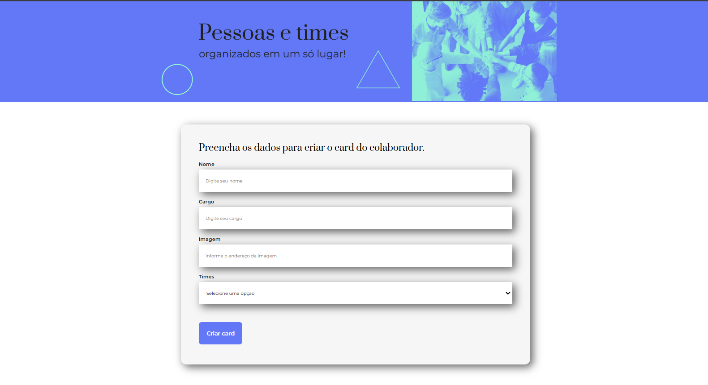
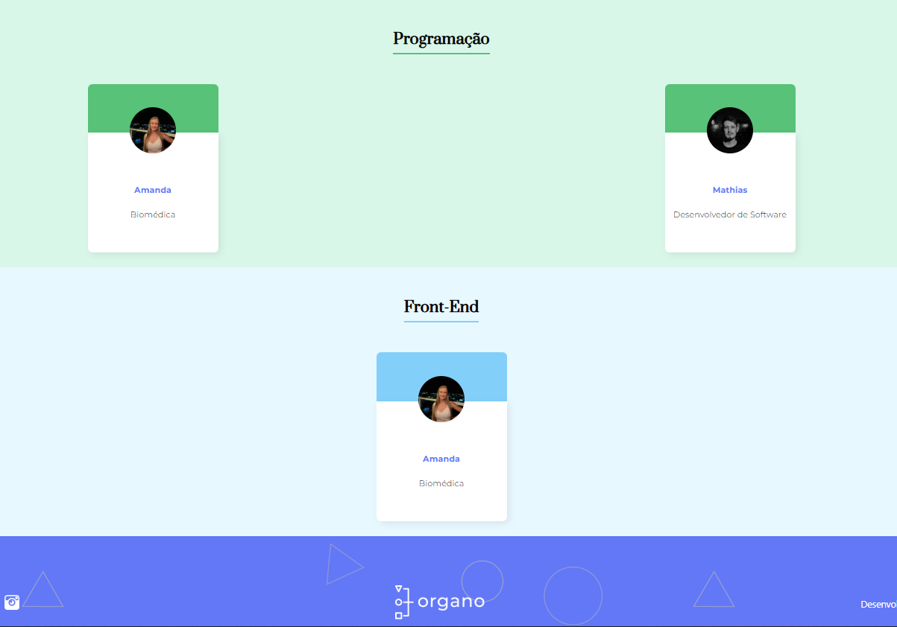

# Organo
Projeto desenvolvido durante o curso de React: desenvolvendo com JavaScript da Alura.

Organo é uma aplicação onde você pode visualizar a estrutura hierárquica de sua equipe e auxilia a gerir os colaboradores, separando-os por times. Com ele, você pode visualizar a estrutura hierárquica de sua equipe de forma intuitiva e organizada.

   
   
 

## ✔️ Técnicas e Tecnologias Utilizadas
Durante o desenvolvimento deste projeto, utilizamos:
- HTML
- CSS
- JavaScript
- React
- Componentização
- Hooks (`useState`)
- Props

## 🎨 Link do Figma
Para visualizar o design do projeto no Figma, clique [aqui](https://www.figma.com/design/KgAuYo3Ex0g5vgXGRXbyOp/React%3A-desenvolvendo-com-JavaScript-%7C-Organo-(Community)?node-id=134-143&m=dev&t=c6GSoEcP53FIlGOM-1).

#
